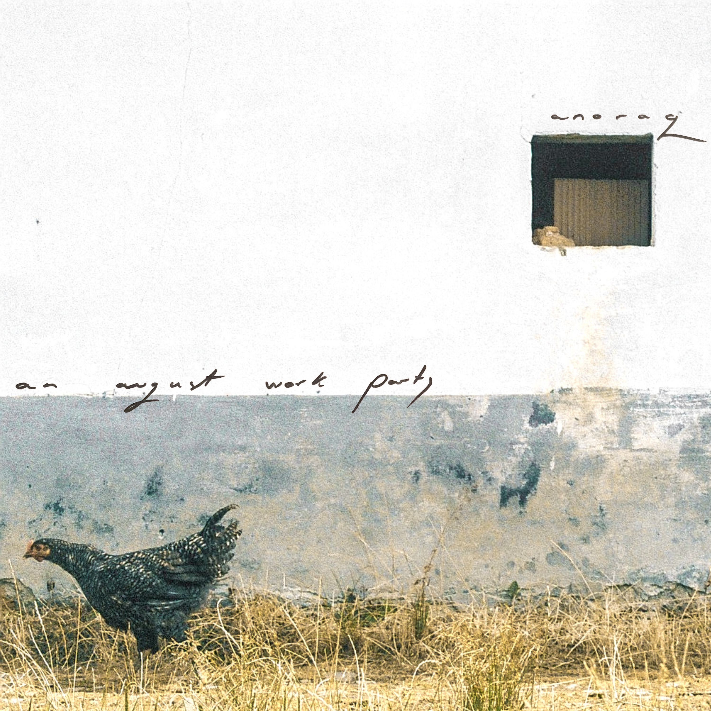

[home](index.md)  |  [about](about.md)   |  [glass knot sun](glassknotsun.md)  |      [wet grain](wetgrain.md)  |  

 
 

## An August Work Party

      

  

 

**An August Work Party** is the debut album by anoraq, a Glasgow-based folk/electronica/ambient band. It is available on streaming platforms and can also be bought [here](https://anoraq.bandcamp.com/album/an-august-work-party)

Patrick Romero McCafferty (vocals) • Tim Martin Ciubotaru (guitar) • Alex Palmer (percussion) • Lewis Hall (keys) • Peter Alec Kay (fiddle & bass) • Mixed and mastered by Peter Alec Kay & Barry Reid • Cover photograph and design by Clara Ionita 

 

**Anoraq** was The Scotsman's Artist of the Week in April 2025. The band has supported as diverse acts as LYR (Simon Armitage) and hip-hop duo Frankie Stew & Harvey Gun. Since 2023, the band has hosted [Inside Voices](insidevoices.md), a poetry and music night at King Tut’s, Scotland’s leading small music venue. 

 

    

  

