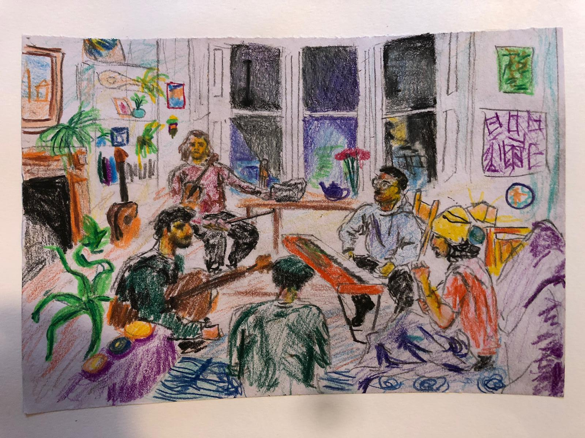

# A N O R A Q 

A Glasgow-based spoken word band.

Patrick Romero McCafferty (vocals) • Tim Martin Ciubotaru (guitar) • Alex Palmer (percussion) • Lewis Hall (keys) • Peter Alec Kay (fiddle & bass) 

Anoraq have supported as diverse acts as LYR (Simon Armitage) and hip-hop duo Frankie Stew & Harvey Gun. 

They founded [Inside Voices](insidevoices.md), a poetry and music night at King Tut’s, Scotland’s leading independent music venue. They 

Their single ['Raisins'](https://open.spotify.com/album/3Huyab6as09iVfEEvGXSmW?si=xrgOcKSNSAid0imYavlKRw) was release in February 2025.

 Sketch by Maddie Bell

