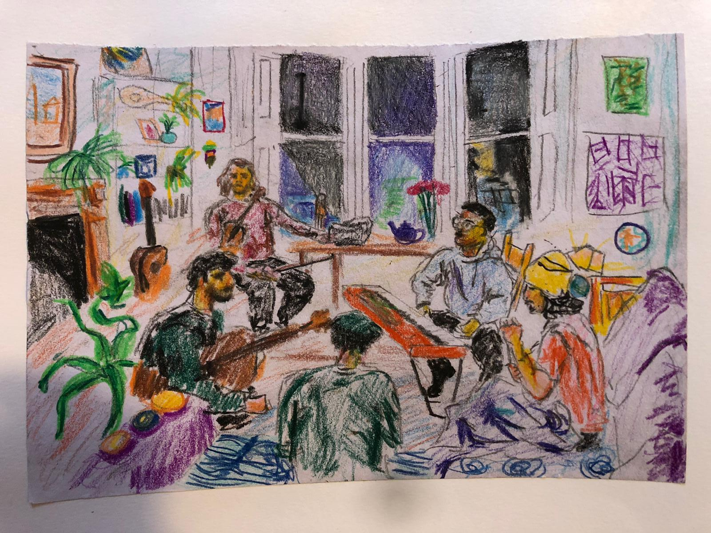

## An August Work Party

      

  

 
Cover photograph and design by Clara Ionita

An August Work Party is the debut album by anoraq, a Glasgow-based spoken word band.    

Patrick Romero McCafferty (vocals) • Tim Martin Ciubotaru (guitar) • Alex Palmer (percussion) • Lewis Hall (keys) • Peter Alec Kay (fiddle & bass) • Mixed and mastered by Peter Alec Kay & Barry Reid

   

Anoraq has supported as diverse acts as LYR (Simon Armitage) and hip-hop duo Frankie Stew & Harvey Gun. Since 2023, the band has hosted [Inside Voices](insidevoices.md), a poetry and music night at King Tut’s, Scotland’s leading small music venue.

 Sketch by Maddie Bell

