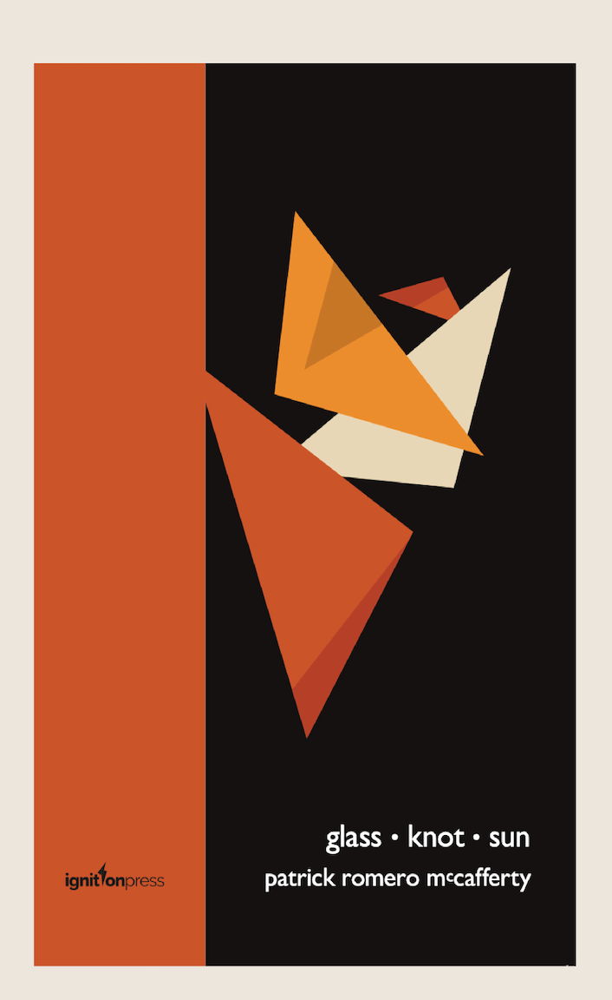

Set between Scotland and Mexico, the poems in *Glass Knot Sun* pose perennial questions of love, labour and land. They do this through the central metaphors of building (from adobe bricks to boat making) and gathering (from windfall almonds to fishing nets), the poem becoming part record of subsistence, part song.

In the face of widespread disconnection and environmental decay, 
McCafferty’s poems remain full of hope, charged with metaphors 
that capture tiny marvels such as ‘the honey / of a summer thought’ 
and ‘sudden islands in the sound of milk’. Revealing a poetics 
that is tender and immersive, inquisitive and wise, the poems display 
a playful reverence for the natural world, capturing its timeless 
vitality and transformative power - Isabelle Baafi

What I find remarkable about Patrick Romero McCafferty is his openness. 
It is there is the writing - an openness to life, an openness to situations, 
people, and moments. He has that sensitivity that marks out the best writers. 
This is the first pamphlet of a writer who is going places - Niall Campbell

[Buy Glass Knot Sun](https://shop.brookes.ac.uk/product-catalogue/faculty-of-humanities-social-sciences/poetry-pamphlets)

