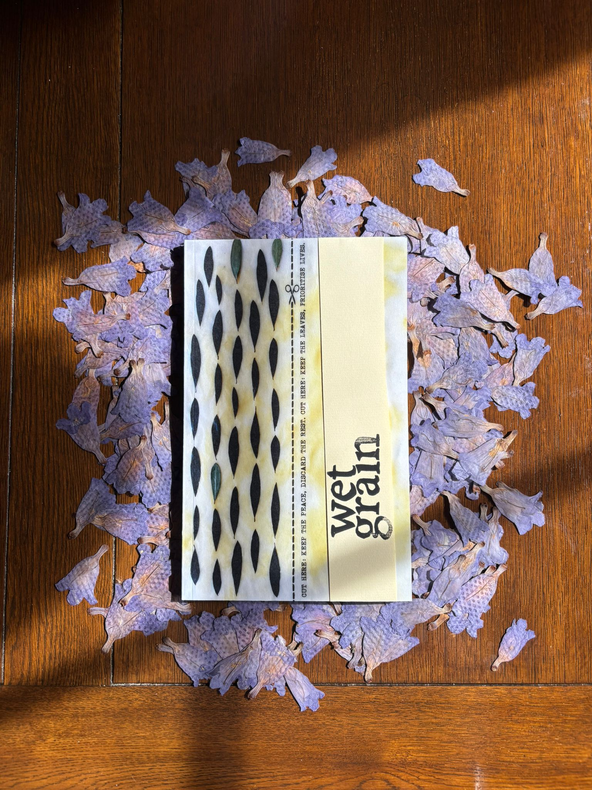

[home](index.md)  |   [about](about.md)  | [glass knot sun](glassknotsun.md)  |   [an august work party](anoraq.md)   |      

 
 

  

## Wet Grain

  

  

[**Wet Grain**](wetgrainpoetry.co.uk) is a magazine for poetry engaging with matters of land-use, provenance, and ownership.

Its most recent issue, Spring 2026, includes work by Kevin Cormack, ariel rosé, Mona Kareem, Dalia Taha, and Alec Finlay.  

Since 2020, the magazine has included the work of emerging poets alongside a Nobel Prize nominee, & recipients of awards including the Pulitzer, the Forward, a MacArthur Fellowship, the Pushcart Prize, the German Book Prize, the Somerset Maugham, and the Eric Gregory. Past issues have been guested-edited by Charles Lang, Eloise Birtwhistle, Sylee Gore, Leo Boix & Nat Teitler FRSL.  

  

