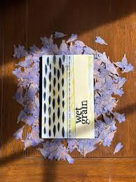

# wet grain

Wet Grain is a magazine for poetry engaging with matters of land-use, provenance, and ownership.

Its most recent issue, Spring 2026, includes work by Kevin Cormack, ariel rosé, Mona Kareem, Dalia Taha, and Alec Finlay.  

Since 2020, the magazine has included the work of emerging poets alongside a Nobel Prize nominee, & recipients of awards including the Pulitzer, the Forward, a MacArthur Fellowship, the Pushcart Prize, the German Book Prize, the Somerset Maugham, and the Eric Gregory. Each issue, selected poets are invited to contribute a short piece of commentary on a poem included in the issue. Past issues have been guested-edited by Sylee Gore (Issue 4), Leo Boix & Nat Teitler FRSL (Issue 5: Latinx).  

  

[wetgrainpoetry.co.uk](https://wetgrainpoetry.co.uk/)
[@wetgrainpoetry](https://www.instagram.com/wetgrainpoetry/)
